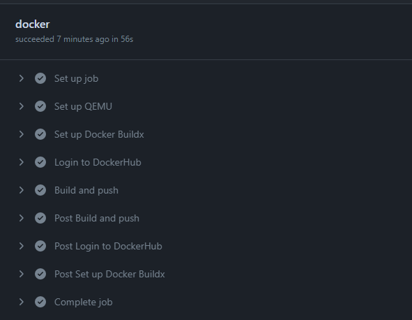

# Bootcamp 4 - Challenge CICD

## Solución

1. Crear un archivo Dockerfile en el directorio del proyecto y crear una imagen a partir de ella.

2. Subir la imagen a DockerHub.

3. Automatizar el proceso de creación de la imagen de Docker y su subida a Docker Hub después de cada cambio en el repositorio utitlizando Github Actions.

5. Se debe crear una aplicación en Heroku y desplegarla allí usando github actions.